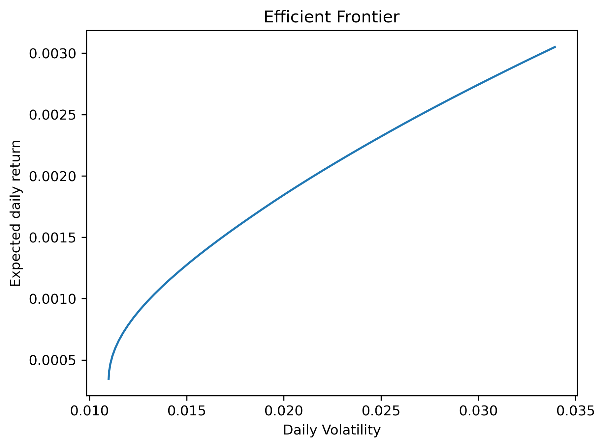
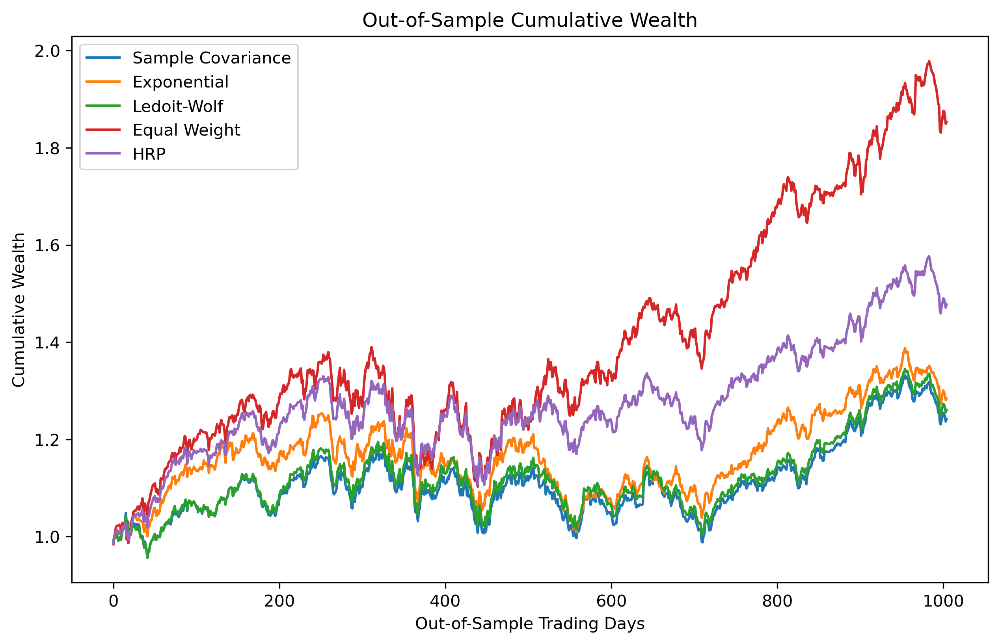

# Portfolio Optimisation and Covariance Estimation

This project investigates how covariance matrix estimation affects the out-of-sample performance and stability of mean-variance optimised portfolios. I compare the standard sample covariance matrix with an exponentially weighted covariance estimator and Ledoit-Wolf shrinkage, using an equally weighted portfolio as a benchmark.

The analysis uses daily returns for 10 large-cap US stocks from 2020 to 2024 and evaluates the strategies using a rolling out-of-sample backtest.

## Methodology

Portfolio weights are selected by maximising the Sharpe ratio subject to long-only weights and full investment constraints. Expected returns are estimated using the sample mean across all methods, allowing the experiment to isolate the effect of changing the covariance estimator.

Three covariance estimation methods are compared:

- **Sample covariance** – the conventional historical covariance matrix.
- **Exponentially weighted covariance** – gives greater weight to more recent observations using a decay factor of 0.94.
- **Ledoit-Wolf shrinkage** – shrinks the sample covariance matrix towards a more structured target to reduce estimation error.

The strategies are evaluated using a 252-trading-day rolling estimation window and a 21-trading-day holding period. A 1/N equally weighted portfolio is included as a benchmark.

## Efficient Frontier

The efficient frontier illustrates the minimum achievable portfolio variance across a range of target expected returns under long-only constraints.

  

## Out-of-Sample Performance

Each covariance estimator is re-estimated using the previous 252 trading days. The resulting maximum-Sharpe portfolio is then held for the following 21 trading days before rebalancing.

  

| Method | Annual Return | Annual Volatility | Sharpe Ratio | Maximum Drawdown |
|---|---:|---:|---:|---:|
| Sample Covariance | 34.24% | 24.37% | 1.285 | -17.42% |
| Exponential | 32.10% | 22.53% | 1.292 | -19.61% |
| Ledoit-Wolf | 34.79% | 24.52% | 1.296 | -17.49% |
| Equal Weight | 20.28% | 19.26% | 0.897 | -29.21% |

All three optimised portfolios substantially outperformed the equal-weight benchmark over the out-of-sample period. Ledoit-Wolf shrinkage produced the highest annual return and Sharpe ratio, while the exponentially weighted estimator achieved lower volatility but also a lower return.

## Portfolio Stability

To examine the sensitivity of the optimised portfolios to changing estimates, I measure turnover between consecutive rebalancing periods and the average maximum individual asset weight.

| Method | Average Turnover | Average Maximum Weight |
|---|---:|---:|
| Sample Covariance | 0.438 | 0.535 |
| Exponential | 0.675 | 0.509 |
| Ledoit-Wolf | 0.420 | 0.518 |

Ledoit-Wolf produced the lowest average turnover, suggesting greater stability between rebalancing periods. The exponentially weighted estimator generated substantially higher turnover despite having a slightly lower average maximum asset weight.

## Transaction Costs

To test whether the performance advantage survives trading costs, proportional transaction costs of 0.1% of portfolio turnover are applied at each rebalance.

| Method | Annual Return | Annual Volatility | Sharpe Ratio | Maximum Drawdown |
|---|---:|---:|---:|---:|
| Sample Covariance | 33.81% | 24.37% | 1.264 | -17.53% |
| Exponential | 31.30% | 22.52% | 1.257 | -19.72% |
| Ledoit-Wolf | 34.29% | 24.52% | 1.276 | -17.60% |

Ledoit-Wolf retains the highest Sharpe ratio after transaction costs. The higher turnover of the exponentially weighted strategy causes a larger deterioration in its performance once trading costs are introduced.

## Conclusion

The results suggest that covariance estimation has a meaningful effect on both portfolio performance and stability. In this experiment, Ledoit-Wolf shrinkage provided the strongest overall results: it achieved the highest out-of-sample return and Sharpe ratio while also producing the lowest portfolio turnover.

Exponential weighting reduced realised volatility but generated considerably more turnover, weakening its performance once transaction costs were included. The results therefore suggest that reducing covariance estimation error through shrinkage can improve the robustness of mean-variance optimisation.

## Limitations and Extensions

The analysis is based on a relatively small universe of 10 US equities and a single historical period, so the results should not be interpreted as evidence that one estimator will dominate across all markets or regimes. Expected returns are also estimated using historical sample means, which are themselves subject to substantial estimation error.

Possible extensions include testing a larger asset universe, varying the estimation and rebalancing windows, examining different market periods and performing additional sensitivity analysis on the transaction-cost assumption.

## Technologies

Python, NumPy, pandas, SciPy, scikit-learn, Matplotlib and yfinance.
