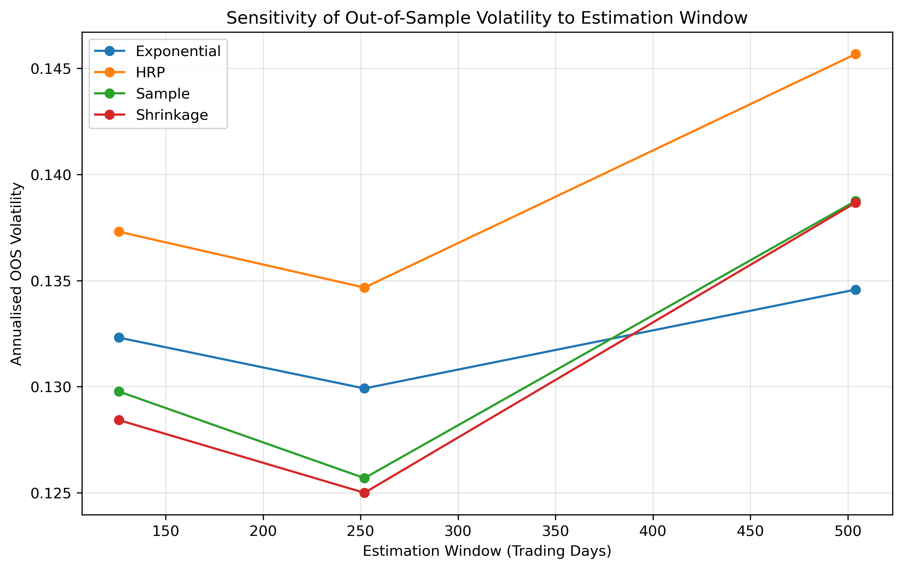
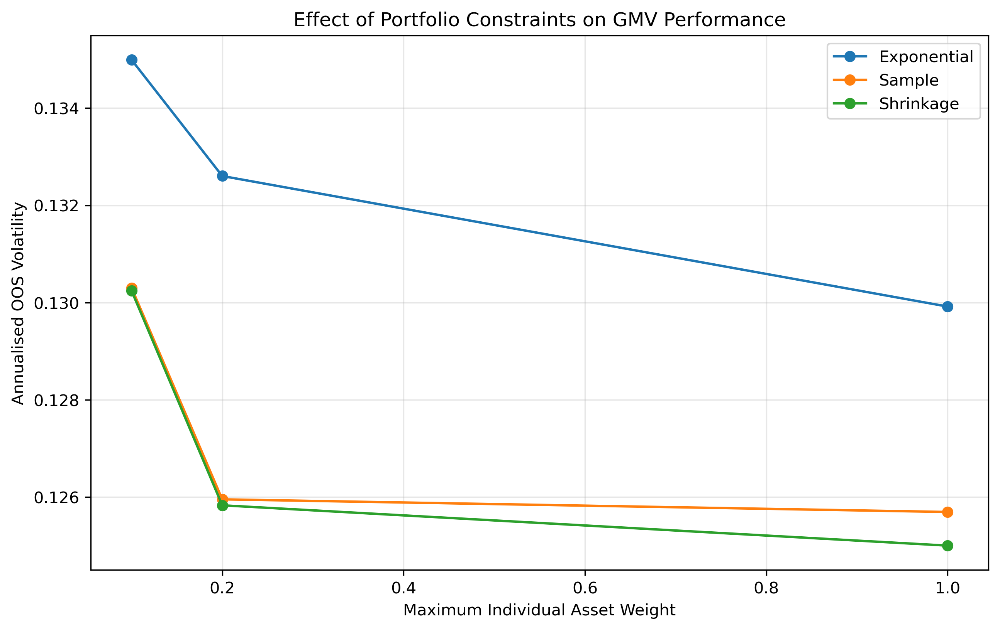

# Covariance Estimation and Portfolio Robustness

## Research Question

**How does covariance estimation affect out-of-sample portfolio robustness, and when do shrinkage, constraints and hierarchical portfolio construction improve realised performance?**

## Overview

This project investigates how covariance estimation and portfolio construction choices affect the out-of-sample behaviour of minimum-variance portfolios.

Using a diversified universe of 23 US equities from 2020–2024, I compare three covariance estimators within a long-only Global Minimum Variance (GMV) framework:

- Sample covariance
- Exponentially weighted covariance (EWMA)
- Ledoit-Wolf shrinkage

These portfolios are evaluated against two alternative allocation benchmarks:

- Equal-weight portfolio
- Hierarchical Risk Parity (HRP)

The analysis uses rolling out-of-sample backtests to examine not only realised return and volatility, but also portfolio concentration, turnover, transaction costs and sensitivity to estimation-window and portfolio-constraint choices.

## Methodology

Daily equity returns are used to estimate covariance matrices over rolling historical windows. Portfolio weights are re-estimated every 21 trading days and evaluated on the subsequent out-of-sample period.

For the main specification, covariance matrices are estimated using a 252-trading-day window. Global Minimum Variance (GMV) portfolios are constructed by minimising estimated portfolio variance, subject to the portfolio being fully invested, long-only, and with individual weights between 0 and 100%.

The covariance matrix is estimated separately using sample covariance, EWMA and Ledoit-Wolf shrinkage.

HRP provides an alternative to conventional numerical portfolio optimisation. Correlation distances are used for hierarchical clustering, after which recursive bisection allocates capital according to cluster risk.

An equal-weight portfolio provides a simple diversification benchmark.

## Evaluation

Out-of-sample portfolios are compared using:

- Annualised return
- Annualised volatility
- Sharpe ratio
- Maximum drawdown
- Portfolio turnover
- Maximum individual asset weight
- Herfindahl-Hirschman Index (HHI)
- Performance after transaction costs

Additional robustness tests vary:

- **Estimation window:** 126, 252 and 504 trading days
- **Maximum asset weight:** unconstrained, 20% and 10%

This allows the analysis to distinguish realised risk performance from portfolio stability and diversification.

## Main Results

Under the main 252-day estimation window, Ledoit-Wolf produced the lowest realised volatility among the GMV covariance estimators:

| Method | Annual Return | Annual Volatility | Sharpe Ratio | Maximum Drawdown |
|---|---:|---:|---:|---:|
| Sample Covariance | 6.22% | 12.57% | 0.257 | -16.12% |
| EWMA | 7.12% | 12.99% | 0.317 | -19.50% |
| Ledoit-Wolf | 6.59% | 12.50% | 0.287 | -15.97% |
| Equal Weight | 16.74% | 15.96% | 0.861 | -20.67% |
| HRP | 10.70% | 13.47% | 0.572 | -16.80% |

The differences between the GMV estimators are relatively small in terms of realised volatility, but their resulting portfolio characteristics differ substantially.

Ledoit-Wolf generated lower concentration and turnover than the sample covariance portfolio. Its average HHI was 0.168 compared with 0.210 for sample covariance, while average turnover was 0.193 compared with 0.221.

EWMA generated substantially greater portfolio turnover (0.953). As a result, its performance was more sensitive to transaction costs: its annual return fell from approximately 7.12% to 6.00% after costs.

HRP produced the most diversified allocations. Its average maximum asset weight was approximately 12.4%, compared with 29–35% for the unconstrained GMV portfolios, while its average HHI was only 0.062. This diversification came with higher realised volatility than the GMV portfolios.

Equal weighting generated the highest return and Sharpe ratio over the particular out-of-sample period, although with substantially higher volatility than the GMV strategies.

## Robustness Tests

### Estimation Window

Portfolio results were recalculated using 126-, 252- and 504-day estimation windows.

The 252-day specification generated the lowest realised volatility for each of the four actively estimated portfolio methods in this sample. The results also show that covariance-estimation choices remain relevant across different amounts of historical information.

Return and Sharpe-ratio comparisons across these windows should be interpreted cautiously because changing the estimation-window length also changes the starting date of the out-of-sample evaluation period.

### Portfolio Constraints

Maximum individual asset weights of 20% and 10% were imposed on the GMV portfolios.

Tighter constraints substantially reduced portfolio concentration. For example, the sample-covariance portfolio's average HHI declined from 0.210 when unconstrained to 0.130 under a 20% cap and 0.087 under a 10% cap.

However, tighter constraints did not produce lower realised volatility in this sample. This illustrates the trade-off between restricting concentrated optimiser solutions and preserving the minimum-variance allocation implied by the estimated covariance matrix.

## Conclusions

The results suggest that covariance estimation affects portfolio robustness through more than realised volatility alone.

Ledoit-Wolf shrinkage produced a less concentrated and more stable GMV portfolio than sample covariance while achieving slightly lower realised volatility in the main specification. EWMA responded more aggressively to changing observations, generating substantially higher turnover and greater sensitivity to transaction costs.

HRP provided a different form of robustness: hierarchical clustering and recursive risk allocation produced considerably more diversified portfolios without relying on conventional minimum-variance optimisation, although realised volatility was higher than for the GMV portfolios.

Explicit weight constraints were also effective at controlling concentration, but tighter diversification constraints did not automatically improve realised risk.

Overall, the analysis highlights a trade-off between **risk minimisation, diversification and allocation stability**. Improving the robustness of portfolio construction therefore depends not only on selecting a covariance estimator, but also on controlling how estimation uncertainty propagates into portfolio weights.

## Implementation

The project is implemented in Python using:

- `pandas` and `NumPy` for data manipulation
- `yfinance` for historical equity data
- `SciPy` for constrained optimisation and hierarchical clustering
- `scikit-learn` for Ledoit-Wolf covariance estimation
- `Matplotlib` for visualisation

The backtest uses rolling estimation windows with 21-trading-day holding periods and out-of-sample evaluation.

## Limitations

The results are specific to the selected asset universe and sample period and should not be interpreted as evidence that any portfolio method universally outperforms another.

Covariance estimation error is not observed directly because the true covariance matrix is unknown. Instead, the project evaluates its practical consequences by comparing alternative estimators through the out-of-sample portfolios they produce.

The transaction-cost model is simplified and applies proportional costs based on changes between successive target portfolio weights. More detailed implementations could account for weight drift, bid-ask spreads and asset-specific trading costs.

Finally, estimation-window robustness tests do not use identical out-of-sample calendar periods, so differences in return across window lengths partly reflect differences in the evaluation period.

## Repository Structure

- `portfolio-optimisation.py` — main analysis and backtesting code
- `cumulative_wealth.png` — out-of-sample cumulative wealth comparison
- `window_robustness_volatility.png` — estimation-window sensitivity
- `constraint_robustness_volatility.png` — maximum-weight constraint sensitivity
- `efficient_frontier.png` — sample efficient frontier
- `requirements.txt` — Python dependencies
